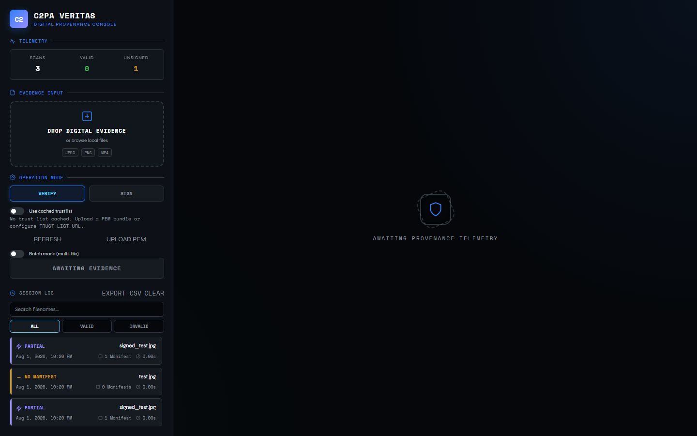
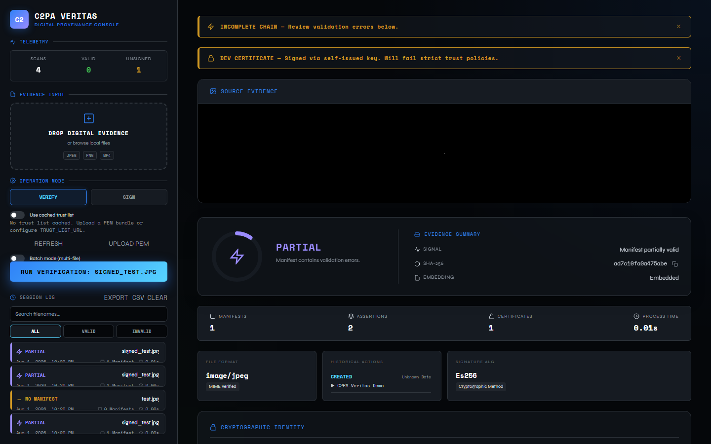
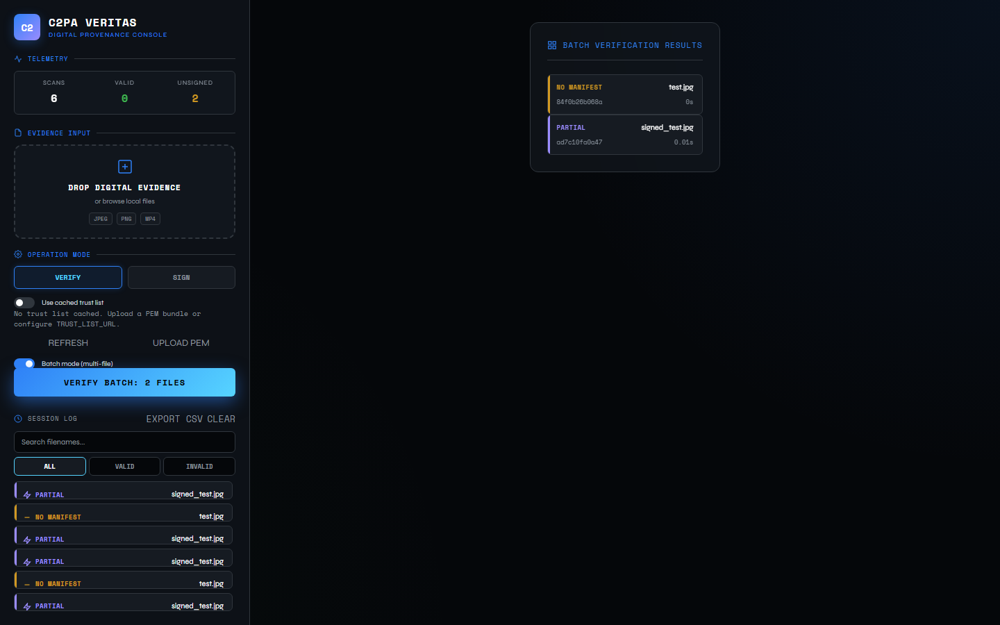
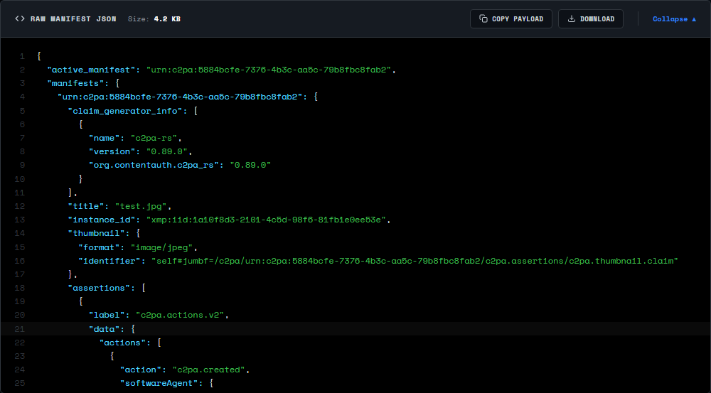
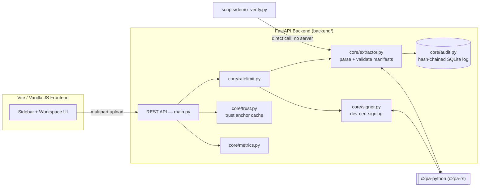

# C2PA-Veritas

**A media content provenance verifier and signer** built on the C2PA (Coalition for Content Provenance and Authenticity) open standard — the cryptographic complement to AI-based deepfake detection.

[](https://github.com/niiomar/C2PA-Veritas/actions/workflows/ci.yml)
[](https://www.python.org/)
[](https://nodejs.org/)
[](Dockerfile)
[](LICENSE)
[](CONTRIBUTING.md)

---

## Table of Contents

- [Overview](#overview)
- [Screenshots](#screenshots)
- [Key Features](#key-features)
- [How It Works](#how-it-works)
- [Relationship to ViT-CORE-FORENSICS](#relationship-to-vit-core-forensics)
- [Quick Start](#quick-start)
- [Development Mode](#development-mode-hot-reload)
- [Testing](#testing)
- [CLI Demo](#cli-demo-no-server-required)
- [Docker](#docker)
- [API Reference](#api-reference)
- [Configuration](#configuration)
- [Project Structure](#project-structure)
- [Security & Deployment Notes](#security--deployment-notes)
- [Contributing](#contributing)
- [Related Projects](#related-projects)
- [License](#license)

---

## Overview

Where [ViT-CORE-FORENSICS](https://github.com/niiomar/VIT-CORE-FORENSICS) asks *"does this media look manipulated?"*, C2PA-Veritas asks *"can we cryptographically verify where this media came from and what has been done to it?"* — the two systems cover complementary halves of the media authenticity problem.

C2PA is an open standard backed by Adobe, Microsoft, BBC, Sony, and OpenAI. Content signed with C2PA carries a cryptographically verified edit history embedded directly in the file. C2PA-Veritas parses and validates these manifests, surfaces the edit timeline, detects stripped or absent credentials, and can sign new files with a development certificate for full round-trip testing — all built on the official [`c2pa-python`](https://github.com/contentauth/c2pa-python) SDK, not a reimplementation of the spec.

## Screenshots

<table>
<tr>
<td width="50%">

**Idle state**


</td>
<td width="50%">

**Verification result**


</td>
</tr>
<tr>
<td width="50%">

**Batch verification**


</td>
<td width="50%">

**Raw manifest JSON**


</td>
</tr>
</table>

*All screenshots are genuine app output (Playwright-driven, headless Chromium) — not mockups.*

## Key Features

- **Manifest extraction** — reads C2PA JUMBF manifests from JPEG, PNG, WebP, AVIF, MP4, MOV, PDF
- **Signature validation** — verifies certificate chains against configurable trust anchors
- **Edit history timeline** — flattens action assertions across the full manifest store into a chronological view
- **Stripped-manifest detection** — explicitly surfaces `NO_MANIFEST` as a forensic signal
- **AI training policy extraction** — surfaces `c2pa.training-mining` assertions (notAllowed / allowed / constrained)
- **Demo signing** — signs files with a dev certificate for create→verify round-trip testing
- **Forensic audit log** — every check recorded in SQLite, keyed by file SHA-256, and **hash-chained** so post-hoc edits or deletions of past rows are detectable
- **Batch verification** — verify up to 25 files in a single request, with per-file results clickable through to the full detail view
- **Sequence completeness (Veritas extension)** — an optional, non-standard `veritas.batch` assertion lets a set of related assets declare an expected count; verification cross-checks it against the audit log to flag missing (omitted) members. **Not part of the official C2PA spec** — clearly labeled as such in the UI.
- **Trust list support** — cache a PEM trust anchor bundle from an operator-configured URL or a manual upload (API or sidebar panel), and opt individual verifications into using it
- **CSV audit export** — download the full audit log via `/history/export.csv`
- **Rate limiting** — per-API-key (or per-IP) sliding-window limits on the expensive endpoints
- **Security headers** — a real `Content-Security-Policy` (`script-src 'self'`, no inline-script exceptions), `X-Content-Type-Options`, `X-Frame-Options`, `Referrer-Policy` on every response
- **Prometheus metrics** — request/verification counters at `/metrics`
- **REST API** — `/verify`, `/verify/batch`, `/sign`, `/history` endpoints with optional API key auth
- **CLI tool** — `python scripts/demo_verify.py image.jpg` with no server required

## How It Works



Every `/verify` call is logged to the audit table with the row chained to the one before it (`prev_hash` → `row_hash`), so `GET /api/v1/audit/verify` can detect if a past entry was altered or deleted after the fact.

## Relationship to ViT-CORE-FORENSICS

| | ViT-CORE-FORENSICS | C2PA-Veritas |
|---|---|---|
| Approach | ML probabilistic detection | Cryptographic provenance verification |
| Works without C2PA data | ✅ | Returns `NO_MANIFEST` signal |
| Output | FAKE / REAL + attention heatmap | VALID / INVALID / NO_MANIFEST + edit timeline |
| Explainability | Attention Rollout | Certificate chain + edit history |

Together they cover the full media authenticity problem.

## Quick Start

### Prerequisites
- Python 3.10+
- Node.js 18+ (CI runs on Node 20)

### 1. Clone

```bash
git clone https://github.com/niiomar/C2PA-Veritas.git
cd C2PA-Veritas
```

### 2. Backend setup

```bash
cd backend
python -m venv venv

# Windows
venv\Scripts\activate

# macOS / Linux
source venv/bin/activate

pip install --upgrade pip
pip install -r requirements.txt
cp .env.example .env
```

### 3. Frontend setup

```bash
cd ../frontend
cp .env.example .env        # set VITE_API_KEY to match backend/.env
npm install
npm run build                # compiles into backend/static/
```

### 4. Run

```bash
cd ../backend
uvicorn main:app --reload
```

Open **http://localhost:8000**

## Development Mode (hot reload)

**Terminal 1 — Backend:**
```bash
cd backend
source venv/bin/activate    # or venv\Scripts\activate on Windows
uvicorn main:app --reload
```

**Terminal 2 — Frontend:**
```bash
cd frontend
npm run dev                 # → http://localhost:3000, proxies /api to :8000
```

## Testing

```bash
# Backend — unit tests (extractor, signer, audit, trust, metrics) +
# route-level tests against the real FastAPI app via TestClient
cd backend
pip install -r requirements-dev.txt
pytest tests/ -v

# Frontend — vitest + jsdom: pure-function tests (escape.js, format.js) and
# DOM-rendering tests for the security-sensitive render/*.js modules
cd frontend
npm run test
```

Both suites run in CI (`.github/workflows/ci.yml`) on every push and pull request against `main`, alongside a `py_compile` check on every backend module and a production `npm run build`.

## CLI Demo (no server required)

```bash
# Pretty-printed report
python scripts/demo_verify.py path/to/image.jpg

# Raw JSON output
python scripts/demo_verify.py path/to/image.jpg --json
```

## Docker

```bash
cp backend/.env.example backend/.env
cp frontend/.env.example frontend/.env
# Edit both files

docker compose up --build
```

The container runs as a non-root user with all Linux capabilities dropped (`cap_drop: ALL`) and `no-new-privileges` set — see `docker-compose.yml`.

## API Reference

All endpoints except `/health` and `/metrics` require an `X-API-KEY` header when `API_KEY` is set in `backend/.env`. `/verify`, `/verify/batch`, and `/sign` are additionally rate-limited (see [Configuration](#configuration)).

| Endpoint | Method | Description |
|---|---|---|
| `/api/v1/verify` | `POST` | Verify a single file's C2PA provenance |
| `/api/v1/verify/batch` | `POST` | Verify up to 25 files in one request |
| `/api/v1/sign` | `POST` | Sign a file with a dev certificate, returns binary download |
| `/api/v1/history` | `GET` | Paginated audit log (`limit`, `offset`) |
| `/api/v1/history/export.csv` | `GET` | Full audit log as CSV |
| `/api/v1/history/{sha256}` | `GET` | All past checks for a specific file hash |
| `/api/v1/audit/verify` | `GET` | Recompute and verify the audit log's hash chain |
| `/api/v1/trust-list` | `GET` | Trust anchor cache status |
| `/api/v1/trust-list/refresh` | `POST` | Re-fetch the trust bundle from `TRUST_LIST_URL` |
| `/api/v1/trust-list/upload` | `POST` | Cache a manually-uploaded PEM trust bundle |
| `/metrics` | `GET` | Prometheus-format counters (unauthenticated) |
| `/health` | `GET` | Liveness check (unauthenticated) |

### `POST /api/v1/verify`

**Form fields:** `file` (required), `trust_anchors` (optional PEM string), `use_trust_list` (optional bool — use the cached operator-configured trust list instead of the built-in one)

**Response fields:**
```json
{
  "status": "VALID | INVALID | NO_MANIFEST | PARTIAL | REMOTE_MANIFEST",
  "validation_state": "Valid",
  "signal": "Human-readable verdict string",
  "active_manifest": { "issuer": "...", "signing_algorithm": "...", "actions": [...] },
  "edit_timeline": [{ "action": "c2pa.created", "when": "...", "software_agent": "..." }],
  "sequence_invariants": { "batch_id": "...", "expected_count": 3, "actual_count": 2, "is_veritas_extension": true },
  "file_sha256": "...",
  "processing_time_sec": 0.4,
  "disclaimer": "..."
}
```
`sequence_invariants` is only present when the manifest carries the optional Veritas `veritas.batch` extension (see [Key Features](#key-features)).

### `POST /api/v1/verify/batch`
Same form fields as `/verify`, but `files` (plural) accepts multiple uploads. **Response:** `{ "results": [{ "filename", ...ProvenanceReport }], "count": n }`.

### `POST /api/v1/sign`
**Form fields:** `file`, `action`, `software_agent`, `no_ai_training`, `claim_generator`, `batch_id` (optional, Veritas extension), `batch_expected_count` (optional, Veritas extension).

### `GET /api/v1/audit/verify`
Best-effort tamper *evidence* for a single SQLite file on one host — not a distributed-ledger-grade guarantee. Returns `{ "valid": bool, "rows_checked": n, "first_broken_id": id | null }`.

## Configuration

### `backend/.env`

| Variable | Default | Description |
|---|---|---|
| `API_KEY` | *(unset)* | Shared secret for `X-API-KEY` auth. Unauthenticated if unset. |
| `CORS_ORIGINS` | `http://localhost:8000,http://127.0.0.1:8000` | Allowed frontend origins. |
| `AUDIT_DB_PATH` | `audit_log.db` | SQLite audit log path. |
| `TRUST_LIST_URL` | *(unset)* | Optional URL to a PEM trust anchor bundle. Only fetched via the authenticated `/trust-list/refresh` endpoint — never per-request, so this can't be used for SSRF. |
| `TRUST_LIST_CACHE_PATH` | `trust_list_cache.pem` | Where the fetched/uploaded trust anchor bundle is cached on disk. |
| `RATE_LIMIT_MAX` | `30` | Max requests per window to `/verify`, `/verify/batch`, `/sign`, per API key (or per client IP if unset). |
| `RATE_LIMIT_WINDOW_SEC` | `60` | Rate-limit sliding window, in seconds. |

The rate limiter is in-memory and single-process by design — this is a single-container deployment (see `docker-compose.yml`) with no load balancer or multi-instance story, so a Redis-backed limiter isn't warranted yet.

### `frontend/.env`

| Variable | Description |
|---|---|
| `VITE_API_KEY` | Baked into the JS bundle at build time. Must match `backend/.env`'s `API_KEY`. |

## Project Structure

```
C2PA-Veritas/
├── backend/
│   ├── main.py                  # FastAPI app: routes, CSP/security headers, rate limiting
│   ├── core/
│   │   ├── extractor.py         # C2PA manifest extraction + validation engine
│   │   ├── signer.py            # Dev certificate signing for round-trip testing
│   │   ├── audit.py             # Hash-chained SQLite forensic audit log
│   │   ├── trust.py             # Trust anchor list fetch/cache/upload
│   │   ├── metrics.py           # In-memory counters for /metrics
│   │   └── ratelimit.py         # In-memory sliding-window rate limiter
│   ├── requirements.txt
│   ├── requirements-dev.txt     # + httpx, for FastAPI's TestClient
│   ├── .env.example
│   ├── static/                  # Vite build output (generated — not tracked in git)
│   └── tests/
│       ├── conftest.py          # Shared env setup + blank_jpeg fixture
│       ├── test_api.py          # Route-level tests via FastAPI TestClient
│       ├── test_extractor.py
│       ├── test_signer.py
│       ├── test_trust.py
│       └── test_metrics.py
├── frontend/
│   ├── src/
│   │   ├── app.js               # Entry point — state, event wiring, orchestration
│   │   ├── styles.css           # Full design system
│   │   ├── components/          # sidebar.js, workspace.js, history.js (templates)
│   │   ├── render/              # One module per result panel — verdict, certPanel,
│   │   │                        #   timeline, aiPolicy, sequencePanel, metrics, rawJson
│   │   └── utils/                # api.js, escape.js, format.js (+ *.test.js)
│   ├── index.html
│   ├── .env.example
│   ├── package.json
│   └── vite.config.js           # builds to ../backend/static; test config for vitest
├── scripts/
│   └── demo_verify.py           # CLI verification tool
├── docs/screenshots/             # README screenshots
├── .github/workflows/ci.yml     # backend (pytest) + frontend (vitest, build) jobs
├── .gitignore
├── Dockerfile
├── docker-compose.yml
├── CONTRIBUTING.md
├── SECURITY.md
└── LICENSE
```

## Security & Deployment Notes

- `VITE_API_KEY` is compiled into the public JS bundle — it is not a secret. For any exposed deployment, place the application behind a reverse proxy (Nginx, Caddy) with IP allowlisting or mutual TLS.
- The dev signing certificate in `core/signer.py` is auto-generated, self-signed, and held only in memory — it is for local testing only and will not pass public C2PA trust validation. A file signed with it and re-verified will correctly come back `PARTIAL` (untrusted signing credential), not `VALID` — that's expected, not a bug.
- A `Content-Security-Policy` with a strict `script-src 'self'` is set on every response; there are no inline `<script>` tags or `onclick=` handlers in the frontend for it to conflict with.
- `/verify`, `/verify/batch`, and `/sign` are rate-limited per API key/IP (see [Configuration](#configuration)); this is single-process and resets on restart, appropriate for the current single-container deployment model.
- See [SECURITY.md](SECURITY.md) for vulnerability reporting.

## Contributing

Bug reports, issues, and pull requests are welcome — see [CONTRIBUTING.md](CONTRIBUTING.md) for the setup and pre-PR checklist (tests, build, `py_compile`).

## Related Projects

- [ViT-CORE-FORENSICS](https://github.com/niiomar/VIT-CORE-FORENSICS) — AI-based deepfake detection, the complementary system
- [ViT-CORE](https://github.com/niiomar/ViT-CORE) — the underlying training pipeline (MSc dissertation)
- [C2PA Specification](https://c2pa.org/specifications/specifications/2.1/specs/C2PA_Specification.html)
- [C2PA Trust List](https://c2pa.org/trust-list/)

## License

Released under the [MIT License](LICENSE).
